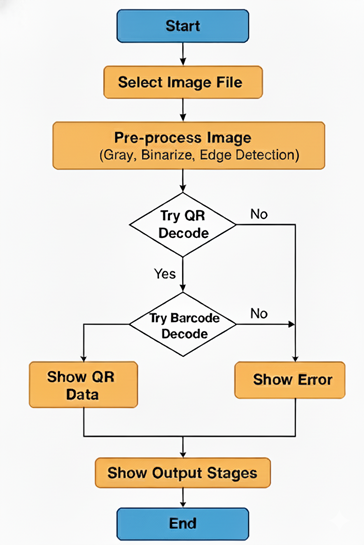
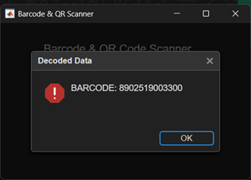
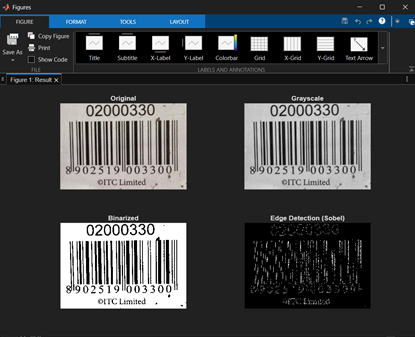
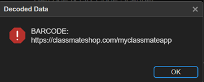
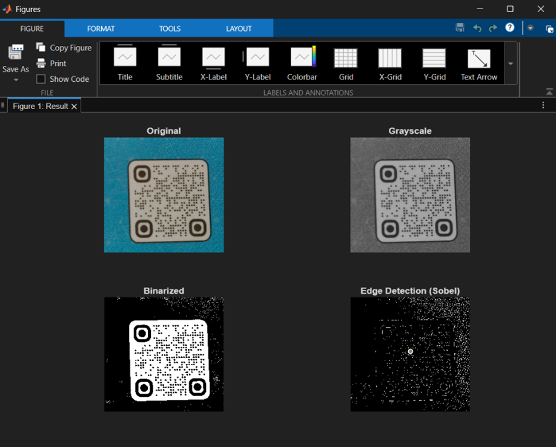

# Project Name
 QR and Barcode Scanning
 
### Project Description:
Robust Scanning System:Implement a barcode and QR code recognition system using image processing techniques such as binarization, edge detection, and pattern recognition.

#### Summary - 
This project presents a simple GUI-based system in MATLAB that can scan and decode barcodes and QR codes from images. The image is pre-processed using grayscale conversion, binarization, and edge detection to improve readability. MATLAB’s decoding functions are then used to extract the embedded information. The system displays both the decoded result and the intermediate processing stages, showing how basic image processing techniques can be applied to real-world identification tasks.

#### Course concepts used - 
1. - Grayscale Conversion
2. - Image Binarization (Thresholding)
3. - Edge Detection (Sobel Operator)
   
#### Additional concepts used -
1. - Pattern Recognition (Code Structure Detection)
2. - GUI Development (UIFigure)
   

#### Novelty - 
1. - Combines barcode and QR scanning in a single interface.
2. - Uses pure image processing (grayscale, binarization, Sobel edge detection).
3. - Displays full DIP stages for educational clarity.
4. - Works without advanced toolboxes.
5. - Automatically detects whether the code is QR or barcode.
6. - Simple, clean GUI built using UIFigure.

   
### Contributors:
1. Madhav S (PES1UG22EC142)
2. G S Sri Harsha (PES1UG23EC308)
3. Saketh S (PES1UG23EC267)

### Steps:
1. Clone Repository
```git clone https://github.com/Digital-Image-Processing-PES-ECE/project-name.git ```

2. Run the Code on Matlab

### Outputs:
* Intermediate steps!


* Final output images 







### References:
1. - MathWorks Documentation. Image Processing in MATLAB: Grayscale, Binarization, Edge Detection, Barcode and QR Code Reading.
Available at: https://www.mathworks.com/help/

   
### Limitations and Future Work:
1. - Low-quality or blurry images may fail to decode, especially barcodes with thin lines.
2. - The system works only for already-saved images, not live camera scanning.
3. - Enhance the GUI with zooming, cropping and image enhancement options.


